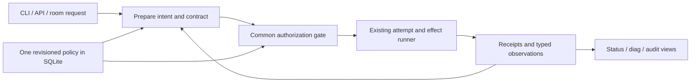

# Peerhub governance and dispatch: one contract, one execution path

Independent Round 1 proposal by cx.astra, 2026-09-24. **DRAFT FOR CROSS-REVIEW; NOT RATIFIED; DESIGN ONLY.**

Companion: [MECE state, transition, and exception specification](GOVERNANCE-DISPATCH-R1-cx-astra-MECE-SPEC-2026-09-24.md). Section IDs D00-D15 align with specification families. Neither document authorizes implementation, policy changes, deployment, or deletion of legacy code.

## D00. Mandate, evidence, and boundaries

The goal is a radically simpler governance/dispatch layer that can replace the entire hub.py/protocol.json arrangement with equivalent-or-better useful capabilities. Exact old syntax, duplicated state files, accidental bypasses, and defects are not preservation requirements. A native capability cannot disappear merely because its old command is awkward. The replacement needs an explicit capability receipt for every legacy operation before cutover.

This is an independent contribution to an already-requested design round. No other model's Round 1 answer was consulted; no hub.py/peerhub asks were dispatched. The proposal is input to subsequent unanimous direction-setting, not a claim that DIR-006 consensus has occurred. The terminal relay envelope is transport context; cx.astra is the selected design worker.

### D00.1 Accepted ground truth

The following are **session-supplied, independently verified audit facts**, accepted without re-running the audits. This attribution does not invent a new `empirical_probe` for this document:

| ID | Accepted fact | Consequence here |
|---|---|---|
| G1 | Production has no collab_rate integration; quorum ignores risk; the feature is absent from active backlog. | Make consultation policy part of every contract, with a release-level wiring test. |
| G2 | Final Call exists but has no production entry path; ordinary voting can stop at quorum or auto-resolve. | Only the common authorization gate can finalize; every command reaches it. |
| G3 | Typed circuit opening, operator quarantine, evidence-backed recovery, and prose review are deliberately distinct. Quarantine review lacks an actual quarantine effect path. | Preserve those distinctions and give a review an explicit authorized effect/result. |
| G4 | Session rotation is implemented and tested in isolation, but ask cannot reach it. Room participation is a different, shipped concern. | Plan a conversation binding on every dispatched attempt; retain separate room membership. |
| G5 | Capability ranking exists; effort-quality scoring was deliberately deferred; ask uses explicit/fixed profiles. | Add an explicit routing policy that can use declarations without pretending they measure quality. |
| G6 | Rate-limit normalization drops rateLimitsByLimitId; 24-hour failure visibility is incomplete. | Normalize all provider limit identities before filtering; derive views and decisions from the same facts. |
| G7 | Query-file IPC is not exposed; internal staged prompt files leak into durable state. | One payload lifecycle for inline, stdin, file, broadcast, and oversize transport. |

Historical local docs are cited for policy intent, **declared, unverified** as descriptions of current runtime behavior. Static inspection in this round establishes only document/source structure, not CLI/model/permission availability. New behavior below is a proposal. Any runtime readiness claim remains **TEST NEEDED** until the companion's boundary tests pass.

### D00.2 Policy precedence and deliberate tensions

The supplied user requirements and standing directives govern this proposal. The later [pre-TDD ratification](HUB-REPLACEMENT-PRE-TDD-FINAL-RATIFICATION-2026-08-26.md) deliberately narrows Final Call to Tier-0, high-risk, or unresolved-dissent decisions. Do not resurrect the older blanket R:8+ requirement by copying an obsolete table. A policy may explicitly request additional Final Calls, but depth alone does not require them in the recommended default.

DIR-006 sets R:10-level unanimity at **direction/plan altitude**, not at each tool call. The reachable-voter exception applies only within that directive's limits; missing votes never count as agreement. DIR-005's exceptional arbiter opinion is separate from human authority and from a quorum count.

There is a real wording tension between literal behavioral superset and the permanent rejection of blind auto-quarantine. Recommended interpretation: preserve the useful outcome (contain an unavailable/unsafe target), preserve explicit operator quarantine, and preserve evidence-backed automatic circuit opening; do not preserve fabrication of evidence or authority. If the user intended identical unsafe automatic quarantine behavior, that requirement conflicts with the accepted ground truth and requires a cross-review/user resolution, not a hidden compatibility mode. See O1 in D15.

## D01. The simple concept

**Describe the intended effect, prove permission to perform it, then perform it once as far as the external system permits. Record what actually happened.**

Three user-facing concepts are sufficient:

1. **Intent**: what work or change is requested, within what bounds.
2. **Contract**: the immutable policy, approvals, and execution bounds for that intent revision.
3. **Receipt**: an observed decision, attempt outcome, or completed effect, with provenance.

They are not three new frameworks. Intent uses the existing request/task identities. Contract extends the existing governance target. Receipt uses existing mutation/attempt/effect records. Evidence and resources are typed inputs and references, not additional workflow engines.

### D01.1 What does and does not unify

collab_rate, Final Call, and quarantine authority reduce to **obligations that must be satisfied before an effect**. They do not reduce to the same kind of vote:

| Question | Obligation | Valid proof | Invalid substitute |
|---|---|---|---|
| Has enough independent review accepted this exact decision? | Consultation | Bound votes and electorate rule | Healthy peer, good benchmark, operator identity alone |
| Did reviewers acknowledge the final candidate without a qualifying late objection? | Final Call | Candidate-bound ACKs | Prior ordinary votes or elapsed time |
| Is this actor allowed to impose the administrative restriction? | Authority | Authenticated operator or expressly delegated grant | Unanimous peer recommendation, repeated stderr |
| Is this target usable now? | Execution admission | Fresh typed observations plus applicable restrictions | Historical approval |

The first three share the gate and its persistence. Admission is rechecked at the execution boundary because a valid decision can outlive a routable peer. Session selection and prompt staging are execution preparation, not voting mechanisms. Diagnostics are projections, not a competing policy engine.

### D01.2 Simplicity budget

Keep one policy resolver, one gate, one authoritative store, one dispatch entry pipeline, and one outcome classifier. Reuse the existing broker, request/attempt runner, leases, evidence algebra, health service, and adapters. Keep domain-specific validation beside the relevant typed command. Do not add a daemon, distributed consensus protocol, arbitrary policy language, general workflow DSL, per-gap database, or new universal resource hierarchy.

The routine operator experience stays `ask`, inspect `status`, and respond to a genuinely missing obligation. `vote` and `ack` are different responses in one review interface. Ordinary work inside an approved plan needs no repeated ceremony.

This is a structural simplification target, not a measured lines-of-code claim. Acceptance requires proving that old parallel vote/finalize/routing paths are removed or reduced to translation into the common path. Fewer names without fewer authorities is not simplification.

## D02. Records, ownership, and persistence

### D02.1 Minimal record contract

The following is a field specification, not implementation code. Reuse existing IDs and field vocabulary where feasible; translate at one boundary if names differ.

| Record | Required meaning |
|---|---|
| Intent | ID, revision, operation kind, actor/origin, room+generation, task/plan parent, typed subject and effect scope, immutable input reference, request idempotency key, desired peer/profile/session preference, deadline/cancellation state. |
| Contract | Intent revision/digest; policy revision and resolved relevant values; classification plus reasons; effect bounds; collab preset; electorate/required voters/quorum rule; human/arbiter/Final Call obligations; deadlines; material dependency revisions; authority epoch. Immutable once opened. |
| Attestation | Actor principal and logical voter identity, kind (`vote`, `final_ack`, `operator_grant`, `arbiter_opinion`), subject/candidate digest, prior-attestation link if correcting, evidence references, receipt time, idempotency key. |
| Authorization receipt | Contract and candidate digest, satisfied obligations or explicit authorized exception, grant scope/expiry/revocation version, finalizer identity, audit reference. It is not proof that execution occurred. |
| Execution plan | Selected instance/profile and verified binding revision, admission observations, session binding/fingerprint, payload handle, adapter transport, resource reservation, attempt fence, parent authorization reference. |
| Outcome receipt | Intent/attempt/effect IDs, execution certainty, typed result/failure, start/end/observed times, verified actual model/permission evidence if available, artifact refs, cleanup state. |

Do not duplicate entire target states into receipts. Store immutable references/digests and the minimal decision proof. Evidence uses the existing vocabulary `MEASURED | ABSENT | UNAVAILABLE | ERROR | STALE`; conflicting measurements retain their individual states and gain a conflict marker at the selection layer, not a new undocumented evidence enum.

### D02.2 Single authority, local transactions

Keep the project's local SQLite authority. Operational policy, instance/profile bindings, contracts, grants, admission restrictions, attempt state, idempotency, reservations, and outbox intents must participate in the appropriate common transaction. Human-readable handoffs and diagnostics are rebuildable views. Exported TOML/JSON is an authoring/import format, never a second live operational policy.

At each state transition: validate actor and expected revision, calculate the typed next state, commit state plus audit receipt plus any effect intent atomically. Notify after commit via the existing outbox. A retry uses the same mutation identity and gets the same receipt. Same key with different content is a conflict. Do not reconstruct authority by replaying arbitrary diagnostic logs.

SQLite transactions are appropriate for local atomic updates; WAL requires same-host coordination and is unsuitable for a shared network filesystem. These are library contracts, not evidence that the deployment has been qualified. [SQLite transactions](https://www.sqlite.org/lang_transaction.html), [SQLite WAL](https://www.sqlite.org/wal.html).

No SQL transaction stays open during a model call, human wait, external process, or filesystem materialization. Commit an effect intent and reconcile the external result. An outbox provides durable delivery intent; it cannot manufacture exactly-once external side effects.

### D02.3 Plan-scoped authorization

A parent authorization states allowed operation kinds, resources, effect classes, routing/profile envelope, aggregate budget, generation, expiry, and material assumptions. Child work inherits it only if a deterministic typed containment check succeeds and the live grant is unrevoked. Containment uses registered operation schemas and canonical resource identities, not an LLM's claim that a change is related.

Routine tool calls, retries with unchanged safe semantics, and checkpoints stay inside that envelope. Changed objective, broader resource/effect/permission scope, newly high risk, or exhausted budget requires a new contract. A new model/profile within the approved envelope needs a new attempt plan, not a new architectural vote; outside it requires reauthorization. A child cannot lower a parent floor.

Consultation requests have an explicit bounded review purpose and authorized disclosure scope. They may gather analysis and attestations without first obtaining consensus on the consultation itself. They cannot use that exemption to execute the proposed implementation. This avoids infinite approval recursion.

## D03. Policy resolution and collab_rate

### D03.1 A small rule table, not a score pretending to be truth

Separate three axes: **impact/risk** (what can go wrong), **consultation** (who must participate), and **work shape** (which execution profile the operator prefers). Complexity does not grant authority; an expensive model does not lower consultation depth.

Resolve typed operation/effect metadata first. Prompt-derived markers may raise a risk floor or suggest a work shape; text cannot claim a human identity, reduce an effect class, or authorize a write. Contradictory risk evidence uses the stricter applicable floor. Unknown material effect scope blocks effect authorization until bounded; it need not block read-only investigation. No numeric confidence is invented.

Merge mandatory obligations conjunctively. Scope/budget permissions intersect; prohibitions union; review requirements tighten; explicit user grants satisfy a named requirement only within their scope. A project/task setting can choose preferences but cannot weaken a standing floor. Ambiguous/incomparable authority rules produce a policy conflict with both rule IDs. Config activation is itself governed under the prior policy revision.

### D03.2 Consultation presets

R:0/3/5/8/10 are discrete public aliases for named obligation presets. They are neither percentages nor a hidden continuous score. An explicit unsupported value such as 4 or 7 is rejected, not rounded. Task/risk rules select a preset; a stronger user request can raise it; a lower request cannot undercut the resolved floor.

Recommended compatibility-oriented starting presets, all stored as policy data:

| Alias | Intended use when no stronger standing rule applies | Approval predicate | Review checkpoints |
|---|---|---|---|
| R:0 | Observations or delegated routine work | No peer vote; actor/parent authorization and execution admission still apply | Policy-defined boundaries only |
| R:3 | Bounded independently reviewed change | At least two agreeing logical voters, including a non-proposer from a distinct failure domain | Plan/effect scope boundary |
| R:5 | Partner review of a consequential bounded plan | At least two and a strict majority for electorates up to three; all voters above that size until a different rule is ratified | Plan and named material milestones |
| R:8 | Broad review | All frozen eligible voters, at least two, plus independent non-proposer | Plan and material scope changes |
| R:10 | Direction, architecture, standing policy, reserved decisions | All frozen required voters affirmatively agree; minimum two; independent non-proposer | DIR-006 direction boundary, not per tool call |

An operator can configure an explicit rational supermajority formula for R:8 or a majority formula above three, but that is a policy change requiring ratification. The default above preserves the existing ratified conservative `N > 3 -> N` behavior instead of silently inventing a risk formula. R:3/R:5 similarity in a three-peer fleet is acceptable; their checkpoint scopes differ. Presets may share predicates without artificial distinctions.

For a count threshold `q`, positive votes must satisfy `agree_count >= q`; required identities must all agree when specified. Abstention does not shrink the denominator. Active non-proposer agreement from a distinct configured failure domain is mandatory for governed peer consensus. Profiles of one logical peer do not become extra voters. Failure-domain mapping is explicit configuration; independence cannot be inferred from different display names.

### D03.3 Electorate formation, absence, and revision

Freeze electorate, required subset, health/readiness snapshot, failure domains, and absence reasons when opening the contract. Required membership and execution routability are different: quarantining a voter does not retroactively delete its vote obligation or erase a previously valid vote. A later identity-compromise finding can invalidate an attestation through an auditable integrity action.

Under DIR-006, non-high-risk direction work may form a reachable electorate of at least two with absence logged, only where the configured standing rule expressly permits it. High-risk work holds for required missing voters or an authenticated, scope-specific human exception. Once opened, no timeout or health sweep shrinks an electorate. Changing it supersedes the old contract and requires fresh attestations.

### D03.4 Quorum is a condition, authorization is a result

Gate states are `REVIEWING`, `FINAL_CALL`, `AUTHORIZED`, `DENIED`, `EXPIRED`, `CANCELLED`, `SUPERSEDED`. Quorum reached is a durable transition receipt/condition within this gate, not a separate workflow that a caller can accidentally leave unfinished. In one broker transition, evaluate the next obligation and either open Final Call, stay waiting for another obligation, or authorize. Every CLI/API submission uses this transition function.

Votes are `AGREE`, `DISAGREE`, `ABSTAIN`, or `BLOCK`. `BLOCK` requires a typed authority/safety/integrity/irreversibility concern and creates a review obligation; free-form disagreement is not automatically a veto. Ordinary dissent is resolved by the configured majority/unanimity/arbiter policy. While REVIEWING, an explicit correction supersedes the old vote and removes it from the tally until a fresh vote is cast. No correction silently preserves quorum. Changing the decision text or electorate creates a new contract.

## D04. Final Call, human authority, and arbiter

### D04.1 Final Call is a candidate integrity barrier

Open Final Call after peer quorum (or an explicit exceptional resolution) and other required non-final authority obligations are satisfied. Freeze a candidate digest covering the subject, contract, effect bounds, current vote receipt set, dissent disposition, and authority grants. Required ACK identities are the frozen electorate/required-reviewer union, recorded before opening. Do not silently replace this with only the voters who happened to agree.

ACK means the actor has seen this exact candidate and is not raising a qualifying late concern. It is not a second vote or a claim that the actor reversed ordinary dissent. Cosmetic/schema preferences may be recorded without blocking. Authority, safety, integrity, and irreversible-effect concerns block authorization and require explicit resolution. Changed substantive content supersedes the contract. A resolved concern that leaves the contract intact creates a new candidate and clears prior ACKs.

Before authorization, ACK retraction removes that actor's ACK and holds the barrier. Concurrent final ACK and retraction are serialized by CAS. If authorization commits first, the retraction becomes a revocation request: it can prevent unclaimed effects; for claimed/running effects it can only fence later work and request cancellation. It cannot undo a completed side effect.

Final Call is mandatory for Tier-0, high-risk, or unresolved-dissent-origin decisions, even if the arbiter subsequently settles the dissent. It is optional only for the ordinary cases allowed by the later ratification. A frozen `final_call_required=true` cannot be toggled by a caller or by a config reload.

### D04.2 Named operator grants

Retain the ratified single designated-human model. A grant binds the authenticated principal, exact subject/contract, permitted exception or effect, expiry, nonce, and authority epoch. A caller string such as `--actor human`, a quoted chat instruction in a peer answer, or a model's assertion of approval is never proof.

The trusted host approval channel must be inaccessible to peer-origin command impersonation. If peer processes share the same OS account and can read host secrets/write the authority store, merely signing grants or checking UID is insufficient. Deployment must establish the boundary or explicitly document a cooperative-process threat model; the stronger impersonation guarantee remains TEST NEEDED. No prompt contains authority credentials. D15 O3 requests review of the smallest adequate host boundary.

Existing scoped user authorization is reusable evidence, not a reason to prompt again. New human interaction is required only when a required grant is absent, expired, revoked, or out of scope. Human exceptions can waive named waivable policy requirements with a durable explanation; they cannot make an unauthenticated actor authenticated or an unknown effect proven absent.

### D04.3 Bounded arbiter

An arbiter opinion is advisory by default. A configured exception may make it canonical for unresolved peer dissent/tie or high-risk decisions under DIR-005. Store the trigger, original votes, permitted override, opinion, and any remaining human/Final Call obligations. Do not rewrite dissent as agreement or report quorum as satisfied when an exception supplied the authority.

Use the configured arbiter profile list and shared budget reservation. Do not derive arbiter identity from the current coordinator. Budget exhaustion or unavailability yields explicit waiting/escalation, never cheap-peer self-promotion. Premium exclusion from bulk selection is separate from whether the peer has another ordinary eligible profile. No recursive arbiter requests; one escalation ancestry and bounded attempts. The standing budget/window/target are imported named settings, not literals in handlers.

## D05. One dispatch path and an honest effect boundary

### D05.1 The fixed sequence

All asks, broadcasts, task stages, administrative effects, and automatic maintenance use the same sequence, skipping inapplicable steps through typed operation metadata:

1. **Ingest** one payload source; authenticate origin; validate command schema and request identity.
2. **Prepare** intent, classify impact/work shape, resolve policy, and link an existing valid plan grant or open a contract.
3. **Authorize** through D03-D04. A WAITING result lists the exact missing obligation; it is not a transport failure.
4. **Plan execution**: route, select session policy, prepare the payload transport, and reserve bounded resources.
5. **Claim** transactionally after rechecking the grant, live authority/restriction epochs, target revisions, deadlines, reservation, session lease, and adapter binding.
6. **Execute** with the claimed attempt fence. Record the process/remote request identity as soon as the adapter can provide it.
7. **Settle** outcome, resource accounting, evidence, and cleanup. Expose the receipt and any unresolved recovery obligation.

The request/attempt/effect runner owns execution. The gate cannot launch subprocesses. A renderer or legacy proposal handler cannot mint an authorization receipt. A read-only status view cannot auto-recover a peer or consume credits. Provider-specific syntax and quirks remain behind adapters; general code never branches on peer name.

### D05.2 Claim, revocation, and crash semantics

For a local database mutation, claim and effect can be one transaction. For a subprocess/external effect, claim is a durable dispatch intent, not proof that the remote side started. Recheck revocation immediately before invoking the adapter, but state the limit honestly: an external effect can race with a revocation after the final check. Strong revocation at the remote commit point requires remote fencing support; otherwise cancellation is best effort after claim.

Execution certainty is `NOT_STARTED | MAY_HAVE_STARTED | STARTED | COMPLETED`. An unknown result after a possible start never authorizes an automatic replay of a non-idempotent operation. An adapter may reconcile by a stable provider request ID or prove no side effect before permitting a retry. Safe read-only/idempotent operations may retry within the contract's bounds. Every new attempt gets a unique ID, payload path, fence, and reservation; the request ID remains stable.

Resource reservations are atomic across concurrent asks. A plan budget is aggregate, not duplicated per child. Uncertain billed usage holds an uncertainty reservation under policy instead of being credited back as zero. Cancellation before claim prevents execution. Cancellation after claim records both the request to stop and the actual observed result; it cannot turn a completed effect into a cancelled fiction.

### D05.3 Broadcast and concurrency

Broadcast freezes a recipient set and creates one child request per recipient under a parent intent. Each child follows the same pipeline and has its own admission, session binding, result, and payload lifetime. Parent status distinguishes all-success, partial completion, failed, cancelled, and unresolved; retry selects only safe unsuccessful children. No claim of atomic all-recipient external execution is made.

Two distinct contracts may review the same resource concurrently. Their intended mutations carry expected resource revisions; only a valid claim against current revisions can execute. Commutative registered operations can proceed independently. Conflicting effects require rebase and, if materially changed, new approval. Locks and leases serialize ownership; they do not grant policy authority. Lease expiry never proves an old process is dead.

## D06. Operational evidence, quarantine, and recovery

### D06.1 Preserve the orthogonal axes

Retain availability, readiness, circuit, and administrative admission as separate facts. A compact eligibility predicate is:

`eligible = registered/enabled AND operationally available AND ready-for-kind AND circuit permits kind AND no applicable administrative restriction AND resource/permission requirements satisfied`.

Each conjunct has its own source and reason. A peer can be reachable but manually quarantined, recovered operationally but forbidden administratively, or healthy but out of quota. No global GREEN label is authority to run.

| Input or operation | Authorized consequence | Cannot imply |
|---|---|---|
| Fresh typed transport/provider evidence | Circuit open/backoff under standing policy | Operator quarantine, quality failure from prose |
| Free-form error report | Deduplicated review request with original provenance | A measured incident or automatic quarantine |
| Operator-authorized quarantine intent | Administrative restriction at named subject scope | Circuit evidence or permission to clear security restrictions |
| Authorized recovery probe plus matching measured result | Update the specific operational circuit/recovery obligation | Automatic removal of a manual/security restriction |
| Authorized administrative release | Remove only the named restriction | Operational readiness or permission to fabricate a successful probe |

Health admission remains one domain authority; routing consumes its snapshots. Typed sources must be mapped to trustable adapter-owned observations, not accepted because peer text contains a field named `exit_code`.

### D06.2 Complete the review-to-action path

Review dispositions are `NO_ACTION`, `NEEDS_EVIDENCE`, `PROPOSE_QUARANTINE`, `PROPOSE_RELEASE`, `PROPOSE_PROBE`, or `ESCALATE_AUTHORITY`. A review recommendation creates/links an ordinary typed intent, for example administrative quarantine of `(instance, profile, authority-class)` with reason and requested scope. The common gate verifies the required designated-operator grant. An execution handler applies the restriction and emits its receipt. Only then can the review be `RESOLVED_APPLIED`.

An escalation routes the missing authority request; it does not call administrative recovery as a generic substitute. Rejecting or cancelling the proposed effect resolves the review with that explicit disposition. Recovery and quarantine are distinct effect kinds even though they share a gate. An authorized operator can quarantine immediately on a stated concern; the record labels that concern as an operator decision, not invented measured failure evidence.

### D06.3 Scope, epochs, and probes

Restrictions have a subject, authority class, reason, creator grant, revision/epoch, and optional expiry policy. Shared-account/provider restrictions apply to their declared member bindings; profile-specific failures do not automatically quarantine every profile or sibling peer. Identity membership changes require a new evaluated scope, not string-prefix inference.

Opening a restriction increments the applicable admission epoch. New claims recheck it. Running work follows its effect-class cancellation policy. Votes remain auditable and frozen; admission changes do not edit electorates. Recovery probes are exclusive bounded requests allowed through a specific circuit exception, with no implicit permission to perform ordinary production work. A stale probe from a prior epoch cannot reopen a newer circuit or clear a later restriction.

Administrative release must name the current restriction revision. Automatic circuit recovery, manual restriction release, policy/security release, and provider-quota reset each have separate proof predicates. Clearing one leaves all others intact. Repeated unknown failures can trigger a review and halt retries, never an evidence-fabricating quarantine counter.

## D07. Automatic profile routing without fabricated quality

### D07.1 Selection algorithm

Use one route decision for `ask`, broadcast children, leader suggestions, and task reassignment. Leader election adds its role/term constraints but does not invent a second profile ranking algorithm.

1. If a peer/profile is explicit, preserve it. If ineligible, explain and hold/fail; do not silently change an explicit target.
2. Otherwise, derive a work-shape category from configured deterministic rules over five recorded inputs: explicit metadata, semantic markers, request structure, multilingual shape, and runtime feedback. Each may be absent. Explicit effect metadata sets the minimum risk independently.
3. Select the policy's preferred profile set for that shape, then filter by enabled binding, required adapter capabilities, actual available evidence, admission, quota/budget, permissions, and contract bounds.
4. Apply configured lexicographic preferences: declared preference tier, continuity, measured resource headroom/cost when available, fair rotation, deterministic final tie-break. Record every exclusion and tie-break.
5. If nothing satisfies mandatory requirements, report the unsatisfied requirement. Use a configured fallback graph only if it remains within the authorized scope; reject cycles and never cross peer boundaries implicitly.

The work-shape map restores prompt-based automatic routing now as an **operator-declared dispatch preference**, e.g. routine/change/ambiguous/complex -> selected profile IDs. It does not claim that a profile's name or reasoning-effort string proves task quality. A verified dispatchable model binding proves what was invoked, not that it solves a task better. Evidence-backed quality ranking is a separate optional input that remains ABSENT until suitable outcome/benchmark evidence exists.

An ambiguous prompt chooses the configured ambiguity profile; it never silently resolves unknown effect authority. Multilingual markers are rule data; unknown languages or conflicting markers have explicit fallback reasons. A `--profile auto` request opts into policy; an explicit profile pin has precedence over suggestions but not over admission/permission floors.

### D07.2 Upgrade path and uncertainty

Measured quality evidence needs task-domain coverage, evaluation revision, actual resolved model/profile, outcome metric, sample/censoring metadata, and freshness. Do not train a router on raw process exit success or on a model self-rating. Profile preference and measured quality stay separately displayed and versioned.

Two defensible policies exist: restore deterministic preference routing immediately, or require quality evidence before *any* automatic profile selection. I recommend the former because it offers the old useful capability without a false measurement claim. If the latter is chosen, the automatic-routing superset requirement remains explicitly unfulfilled until evidence exists. This is O2 in D15.

## D08. Conversation sessions are execution resources

### D08.1 Room membership is not conversation reuse

Room participation/membership/heartbeat determines who shares the durable context. A provider conversation binding determines which model conversation an attempt resumes. Rotating that conversation preserves room identity, task, contract, message cursor, and audit chain. A new room topic increments generation and invalidates incompatible bindings without deleting history.

Expose `session_policy = auto | reuse | fresh | none` on all dispatch surfaces. Keep the already designed pressure thresholds as configurable seed values: soft 75%, hard 90%. They are thresholds for a measured pressure value with compatible units/scope, not assertions that every provider reports it. Capacity/usage absent, stale, or conflicting remains unknown.

| Mode | No binding | Compatible binding below soft | Soft through below hard | At/above hard | Pressure unknown |
|---|---|---|---|---|---|
| auto | Start fresh managed session | Reuse | Rotate with durable continuity capsule | Rotate before dispatch | Use `sessions.unknown_pressure_action`; recommended fresh |
| reuse | Start the first managed session if capability permits | Reuse | Reuse with pressure reason visible | Refuse reuse; offer explicit fresh/new policy | Hold unless configured policy expressly permits unknown-pressure reuse |
| fresh | Start a new managed session | Start a new managed session | Start a new managed session | Start a new managed session | Start a new managed session |
| none | Stateless/unmanaged invocation | Do not bind or resume | Do not bind or resume | Do not bind or resume | Do not bind or resume |

The boundary convention is `< soft`, `soft <= p < hard`, `p >= hard`. A provider hard-context rejection is typed evidence and a dispatch failure/replan trigger, not permission to assume a numeric pressure. Fingerprint mismatch forbids resume in every mode; `auto`/`fresh` can create a fresh compatible binding, while explicit `reuse` reports the conflict for a deliberate retry. If a legacy caller relied on automatic drift retirement even with forced reuse, migration must choose an explicit `reuse_on_drift=fresh` setting and record the semantic delta.

### D08.2 Rotation contract

Use the existing rotation saga concept as a bounded execution preparation transaction: reserve the conversation key, fence prior use, checkpoint required room/task context, start a new binding, validate identity/fingerprint, inject the immutable continuity capsule, switch the active pointer, then retire the old binding. Do not retire the only usable binding before its replacement is durable. Do not copy opaque provider history as authoritative task state.

Conversation key includes room, generation, instance/profile, and session scope. Fingerprint covers model, permission class, normative adapter compatibility fields, and required context/directive revisions; paths and incidental timestamps are excluded. Concurrent calls serialize on the binding lease unless the adapter explicitly declares and proves parallel conversation safety. Rotation and topic change are fenced; a late old attempt cannot overwrite the new active binding.

If a resume is definitively rejected before useful execution, retire/replan according to the configured safe retry limit. If it may have executed, use D05 reconciliation instead. Context preparation failure holds the attempt; it cannot quietly drop standing directives or required lessons. Fresh independent review can intentionally omit other models' answers while retaining required governance context.

No promise about provider caching follows from fresh/reuse. Context usage, quota, and billed tokens are separate measurements. Provider-specific usage normalization is handled by D09.

## D09. Observations and diagnostics share a data contract

### D09.1 Normalize before selecting

Adapter collectors emit typed observations with evidence state, approved source tag (`cli_live`, `app_server`, `statusline`, `empirical_probe`), subject identity, provider/source version, observed/captured time, freshness rule, units, scope, and raw evidence reference. Configured claims are separately rendered **declared, unverified**, never promoted to MEASURED.

For quota: normalize **both** `rateLimits` and **every entry** in `rateLimitsByLimitId` into a collection keyed by provider/account-scope/limit-id/window/model-family applicability. Preserve origin and raw limit ID before any family selection. Repeated representations of the same observation deduplicate; incompatible values remain a conflict with source precedence policy. A default bucket cannot erase a named bucket, and unknown family applicability cannot become either universal eligibility or zero quota by accident.

Windows sharing a pool are not independent balances to sum. Reset times require a coherent time basis. Provider receipts govern billed/token accounting; operational attempts govern execution counts. Inclusive input tokens and cached subsets, delta and cumulative usage, and response/session/thread scopes must stay explicit. Unknown scope cannot be summably treated as delta. Derived headroom/pacing/exhaustion metrics expose formula revision and inputs; they are projections, not provider facts.

### D09.2 Failure-rate contract

For configured lookback W (the compatibility preset is 24 hours), freeze `as_of` and an ingestion high-water mark. Include attempts whose terminal completion falls in `(as_of-W, as_of]` and was ingested by that mark. Deduplicate by attempt ID. For started attempts with definitive execution outcomes, display `failed / (succeeded + failed)` plus the integer counts. Admission rejection, waiting for approval, cancelled, and unknown-result counts are separate. Zero denominator is UNAVAILABLE/no completed attempts, not 0% failure. A failed task-quality evaluation is a separate metric from transport/process failure.

Also expose request-level final failure rate, so multiple retries do not masquerade as multiple independent user failures. Attribute attempted instance/profile and actual resolved model evidence separately. Late receipts produce a newer snapshot/revision; they do not silently alter a previously published snapshot. Missing coverage/short retention shows `partial` plus coverage bounds.

### D09.3 Views and collection

`status` answers what is happening and what blocks it; `diag` explains the observations behind those answers. They share one snapshot assembler and selectors. Both expose policy/contract revisions, eligibility reasons, active restrictions, quota pools, session pressure/binding, retry uncertainty, cleanup debt, 24h rates, and freshness/coverage. Text and JSON render the same typed snapshot.

Default reads use available local evidence and do not invoke models. Explicit refresh can use bounded authorized collectors; it must show which sources refreshed and which failed. Independent sources continue even when another source is absent. Redaction occurs before rendering/log export; provider account identifiers, credentials, and prompt contents are not metric labels. Optional metrics export has bounded label cardinality and cannot become state authority. OpenTelemetry supplies a suitable metrics vocabulary if export is later needed. [OpenTelemetry metrics data model](https://opentelemetry.io/docs/specs/otel/metrics/data-model/).

## D10. One payload lifecycle for file IPC and oversized prompts

### D10.1 Input contract

`ask` and `broadcast` accept exactly one of inline prompt, stdin, or `--query-file <path>`. No source wins silently when several are supplied. `--query-file` reads the caller's source without shell interpolation. The default source ownership is **borrowed**: do not delete arbitrary user files. Explicit managed/consume mode is available for callers that want the old one-shot IPC outcome. Ownership is manifest data, never inferred from a filename timestamp.

Read through one validated handle into a bounded immutable payload snapshot. Preserve original bytes/digest, encoding declaration, and decoding outcome; reject invalid encoding rather than replacing characters. Structured directives/context are separate envelope parts, not semantic edits to USER_QUERY_RAW. The adapter records any required transport framing. Windows spaces, ampersands, Unicode, CRLF, empty files, BOMs, and leading dashes are data, not arguments to a shell.

Input validation covers allowed roots, file identity, regular-file type, reparse/symlink policy, size, ownership, and concurrent modification. Open-handle identity plus hash protects read consistency; canonical path strings alone do not solve junction races. A managed consumed source is removed only after the immutable snapshot is secured and identity rechecked; borrowed sources remain caller-owned. Retrying a borrowed path requires matching the original digest or an explicitly new request.

### D10.2 Attempt-owned staging and cleanup

Use in-memory/stdin transport where the adapter supports it. When a path is required, stage in the configured volatile OS-temp location, outside durable `.peerhub` state. Each **attempt and broadcast child** gets a fresh unpredictable, exclusively created file. Do not overwrite or reuse a zombie path. A metadata-only lease records file identity, owner attempt, content digest, creation time, expected consumer lifetime, and cleanup state.

Keep a staged file until the adapter proves it has consumed it; if no consumption ACK exists, retain through process exit/confirmed death. Then unlink it. On exception/cancellation, settle the consumer identity before cleanup. On Windows an open handle may defer deletion; record cleanup debt and retry within bounded policy. Startup/periodic cleanup only touches files proved owned by expired/dead attempts under the exact managed root. Never glob-delete user sources or unrelated temp files.

The standard library provides exclusive temp creation and lifecycle helpers, but abrupt termination and Windows reopening rules still require this application lifecycle. Use APIs supported by the project's Python floor; do not assume newer `delete_on_close` options exist on Python 3.11. [Python 3.11 tempfile](https://docs.python.org/3.11/library/tempfile.html).

### D10.3 Privacy versus crash replay

Default ephemeral prompts are not written into SQLite payload columns, WAL, durable audit logs, or a backup-synchronized staging directory. Persist metadata and authorized result artifacts only. This means a crash after ephemeral input is gone may require `INPUT_REQUIRED` to resume; do not claim durable replay from a digest.

Callers needing queued/restart-surviving work may explicitly select managed retained input with a TTL, storage protection, disclosure scope, and deletion receipt. The retained canonical input is separate from per-attempt disposable transport copies. A borrowable original file with the exact saved digest is another legitimate replay source. Prompt retention is a visible request policy, never a hidden consequence of an oversized prompt. Deletion means unlink/retention completion, not a guarantee of physical secure erasure from storage or provider history.

Cleanup failure does not rerun a successful model call. Outcome and cleanup state are orthogonal. Staging quotas/age/debt limits can block new staging while keeping metadata/status available. A room broadcast that durably stores message content has that declared effect; its transport scratch files still follow this lifecycle.

## D11. Named configuration surfaces

### D11.1 One effective policy revision

`PolicyRevision` in SQLite is the operational source. An authoring document may organize these keys under `policy`; references such as `sessions.*` abbreviate `policy.sessions.*`. Instance/profile/provider facts remain in the existing registry, referenced by immutable binding revision. Do not duplicate model IDs, permission flags, or quality claims into policy presets.

All configurable choices below are data. Packaged defaults and governed imports supply values; handlers have no silent literals. A missing mandatory setting rejects policy activation. Fixed schema concepts (state names, ID equality, monotonic revision, no forged authority, no duplicate effect by identity) are invariants rather than tunable preferences. No drive letter, peer name, credential, model ID, probability, timeout, retry count, size limit, or risk threshold belongs hardcoded in the gate.

| Policy namespace | Named settings and validation |
|---|---|
| `resolution` | `schema_version`, `scope_precedence`, `protected_rule_ids`, `override_authorities`, `activation_mode`; stricter-only merges, unknown core keys rejected, `x-*` extensions never grant authority. |
| `classification` | `operation_effect_map`, `risk_rules`, `risk_order`, `unknown_effect_action`, `ambiguous_risk_action`, `signal_rules`, `language_rules`; ordered deterministic matching with recorded rule IDs. |
| `governance.presets.<id>` | `alias`, `quorum_kind`, `minimum_agree`, `fraction`, `small_electorate_limit`, `large_electorate_rule`, `required_set`, `independent_agree_required`, `checkpoint_triggers`; rational fractions, possible quorum, monotonic strengthening validated. |
| `governance.electorate` | `voter_set_ref`, `failure_domains`, `reachability_sources`, `reachability_ttl`, `absence_policy_by_risk`, `minimum_reachable`, `formation_deadline`; profiles cannot multiply one logical voter. |
| `governance.final_call` | `required_triggers`, `additional_triggers`, `ack_set_rule`, `blocking_concern_classes`, `ack_deadline`, `retraction_policy`; mandatory triggers cannot be disabled by task overrides. |
| `governance.lifecycle` | `review_deadline`, `escalation_intervals`, `maximum_extensions`, `expiry_action`, `vote_correction_rule`, `dissent_resolution_rule`; all waiting states have an expiry/escalation path. |
| `authority` | `designated_operator_ref`, `trusted_issuer_ref`, `grant_ttl`, `allowed_delegations`, `waivable_requirements`, `revocation_policy`, `authentication_age_limit`; secrets live outside policy and prompts. |
| `arbiter` | `profiles_ref`, `canonical_triggers`, `human_mandatory_triggers`, `budget_count`, `budget_window`, `target_share`, `maximum_attempts`, `budget_exhaustion_action`; standing DIR-005 values imported explicitly. |
| `plans` | `allowed_child_kinds`, `scope_rules`, `material_dependency_fields`, `grant_ttl`, `aggregate_budget`, `checkpoint_rules`, `maximum_children`, `maximum_depth`; deterministic containment or explicit conflict. |
| `dispatch` | `default_deadline`, `idle_timeout`, `heartbeat_interval`, `cancellation_grace`, `retryable_classes`, `retry_limit_by_kind`, `retry_backoff`, `unknown_outcome_action`, `resource_reservation_ttl`, `uncertain_usage_hold`; live output is not idle. |
| `routing` | `work_shape_rules`, `shape_to_profiles`, `ambiguity_profile`, `preference_order`, `required_evidence_by_capability`, `unknown_cost_action`, `fallback_graph`, `cross_peer_fallback`, `fairness_window`, `tie_break`, `random_seed_policy`, `bulk_excluded_profiles`, `quality_evidence_policy`; bounded acyclic graph, no implicit hard-requirement relaxation. |
| `health.circuit` | `trusted_evidence_types`, `source_precedence`, `freshness_ttl_by_type`, `trip_rules`, `backoff`, `cooldown`, `probe_budget`, `probe_exclusivity`, `recovery_predicates`; no prose-as-measurement conversion. |
| `health.administration` | `authority_by_restriction_class`, `scope_expansion_rules`, `restriction_expiry_rule`, `review_dedup_window`, `review_deadline`, `review_disposition_rules`, `running_effect_policy`; manual/security release predicates remain distinct. |
| `sessions` | `default_policy`, `soft_pressure`, `hard_pressure`, `pressure_metric`, `pressure_ttl`, `unknown_pressure_action`, `reuse_on_drift`, `resume_retry_limit`, `binding_lease_ttl`, `rotation_cooldown`, `fingerprint_fields`, `capsule_sections`, `capsule_limit`, `required_context_policy`; soft < hard and metric-compatible thresholds. |
| `payloads` | `allowed_input_roots`, `allowed_encodings`, `maximum_bytes`, `allow_empty`, `reparse_policy`, `default_ownership`, `consume_mode`, `memory_limit`, `staging_root`, `file_permissions_profile`, `retention_mode`, `retention_ttl`, `cleanup_retry`, `cleanup_deadline`, `orphan_grace`, `staging_quota`, `cleanup_debt_limit`; retained and ephemeral roots must not alias accidentally. |
| `telemetry` | `source_priority`, `ttl_by_metric`, `collector_deadlines`, `family_binding_rules`, `conflict_action_by_use`, `failure_window`, `failure_inclusion_policy`, `retention`, `minimum_coverage`, `metric_formulas`, `refresh_policy`, `redaction_profile`, `export_label_allowlist`; no unknown-to-zero normalization. |
| `leases` | `ttl_by_kind`, `renewal_interval`, `clock_skew_tolerance`, `process_identity_policy`, `recovery_action`; lease kinds keep distinct scope and ownership semantics. |
| `leadership` | `challenge_window`, `consecutive_term_limit`, `eligibility_rules`, `preference_ref`, `tie_break`, `handoff_deadline`; terms and authority fencing epochs stay distinct. |
| `rooms` | `resume_window`, `membership_ttl`, `handoff_sections`, `handoff_size`, `generation_rules`, `retention`, `page_size`, `message_visibility`; no private authoritative room history. |
| `knowledge` | `runtime_directive_ttl`, `precedence`, `lesson_activation_authority`, `injection_selection`, `ack_required_severities`, `delivery_retry`, `retention`, `sweep_mark_only`; user directives cannot be machine-authored silently. |
| `artifacts` | `claim_ttl`, `allowed_roots`, `materialization_mode`, `signature_policy`, `archive_retention`, `validation_requirements`; external/file effects use D05. |
| `store` | `local_root`, `busy_timeout`, `transaction_retry_limit`, `audit_retention`, `outbox_retry`, `outbox_deadline`, `index_page_size`, `recovery_limits`, `clock_discontinuity_action`; deployment qualification rejects unsupported storage. |
| `migration` | `observation_window`, `inventory_roots`, `excluded_paths`, `rollback_window`, `archive_retention`, `cutover_approver_ref`; deletion requires complete capability/caller receipts. |

Two policy changes have different effects: ordinary changes govern newly opened contracts; an explicit authenticated revocation/critical-safety action invalidates affected outstanding grants by epoch. No global config reload silently reinterprets frozen votes. Before execution, dynamic admission and explicit revocation are live checks; the contract's historical quorum remains frozen. Tightening permissions can therefore block execution without rewriting the old decision.

### D11.2 Proposed native experience

Command spelling is a proposal, not a claim about current CLI availability:

| Surface | Behavior |
|---|---|
| `peerhub ask [--to ...] [--profile auto\|ID] [--session-policy ...] [--collab-rate ...] [--query-file ...]` | Submit once; link plan authorization if provided; return request ID and result or exact unmet obligations. Inline and stdin alternatives use the same input model. |
| `peerhub broadcast ...` | Same options and policies; child receipts plus aggregate status. |
| `peerhub review <id> --vote ...` / `--ack ...` / `--retract ...` | Distinct typed attestations in one interface; an ACK always binds the displayed candidate digest. |
| `peerhub approve <id>` | Trusted designated-human channel, not an actor-string switch. |
| `peerhub status <id>` / `peerhub diag` | Current state and shared evidence snapshot; JSON/text parity. |
| `peerhub policy explain <id>` | Rule provenance, frozen contract, inherited grant, and blockers; no effects. |
| Existing typed room/task/health/knowledge/artifact commands | Domain-oriented convenience entrypoints to the same intent/gate/effect pipeline. |

No mandatory universal JSON command for ordinary users. No separate `finalize` command is required to rescue a round after the last valid attestation; automatic evaluation is the normal path. A recovery/reconcile command may retry that evaluation idempotently. There is no generic `--force` bypass.

## D12. Decision rationale: five whys, generalization, and reuse

Each chain below follows five distinct why questions to a real purpose. These are design arguments, not measurements of the existing implementation. Alternatives remain visible so cross-review can reject a simplification if it loses a needed capability.

| Decision | Five-whys chain, W1 -> W5 | Generalization and package decision |
|---|---|---|
| D01/D02 common contract | Why one gate? Prevent contradictory approvals. Why contradictions matter? Multiple entrypoints otherwise mint different authority. Why authority must match? Effects must match what was approved. Why bind effects? Review can become stale as work changes. Why review at all? Keep the user's control over consequential work. | Generalize authorization obligations, not every domain state. Reuse broker + Pydantic strict boundary validation; a validator cannot itself decide policy. |
| D02 SQLite and receipts | Why a transaction? State and permission/effect intent must agree. Why jointly? A crash can separate writes. Why recover? Processes and terminals restart. Why retain identity? Replay must not duplicate effects. Why avoid duplicates? Preserve work, money, and trustworthy history. | Reuse local SQLite/UoW/outbox, not bespoke JSON journals or a distributed event platform. SQLite does not make external effects atomic. |
| D02 parent scope | Why approve plans? Per-tool voting overwhelms useful work. Why avoid repeated votes? Unchanged scope adds no new decision. Why scope matters? New effects can invalidate consent. Why deterministic containment? Prose similarity is not enforceable. Why enforce? Users need bounded delegation. | Reuse typed schemas and existing task hierarchy. Avoid arbitrary workflow/rule languages; Temporal is a candidate only if future durable distributed orchestration is required. |
| D03 presets | Why depth? Different consequences merit different scrutiny. Why voters? Independent perspectives can expose errors. Why freeze membership? Availability must not manipulate consent. Why count logical peers/domains? Profiles can share failure modes. Why preserve review quality? Prevent a coordinator's unchecked mistake. | Named policy presets plus one predicate evaluator. Pydantic validates data; custom domain predicates remain necessary. No ML/rules package is justified for a small finite table. |
| D04 Final Call | Why a late barrier? Reviewers may have missed the final candidate. Why bind a digest? A vote may concern an earlier version. Why ACK distinct from vote? Awareness and substantive preference differ. Why limited veto? Cosmetic objections should not invent safety authority. Why bounded waiting? Decisions need an explicit outcome. | Reuse attestation/gate persistence. A generic state-machine library cannot define these semantics; no new dependency needed. |
| D04 authority/arbiter | Why separate grants? Peer agreement is not human permission. Why authenticate? Peer text can assert any identity. Why exact scope? A prior approval may concern another effect. Why limited arbiter? Expertise does not imply unrestricted authority. Why preserve human reservation? The human bears the consequences. | Reuse trusted host authorization and broker receipts. Do not add an identity provider to a named-operator system without a need; deployment isolation remains O3. |
| D05 runner | Why one path? Dead primitives and bypasses recur across commands. Why claim before start? Concurrent callers/crashes exist. Why certainty states? A timeout cannot prove non-execution. Why bounded retry? Replaying may duplicate side effects. Why disclose uncertainty? Recovery needs honest evidence. | Existing attempts/effect outbox/leases. Tenacity is a candidate for bounded safe collector retries, not for replaying governed effects blindly. |
| D06 admission | Why separate quarantine? Administrative intent differs from transport condition. Why typed evidence? Prose may be mistaken or malicious. Why review first for prose? Humans can still respond without fabricated facts. Why recovery proof? The fault may persist. Why separate release? One success cannot overrule an operator/security restriction. | Reuse health domain + typed effects + common gate. A third-party circuit breaker alone does not supply authority/recovery semantics; no new breaker library. |
| D07 routing | Why automatic profile choice? Routine work should not require manual tuning. Why work-shape rules? Task needs vary. Why label preferences? Quality is not measured by names. Why preserve explicit choice? User intent is stronger than a heuristic. Why retain reasons? A wrong route must be explainable and corrigible. | Reuse capability ranking/registry and deterministic rule data. Do not adopt a learning router before valid outcome data exists. Pydantic handles rule/binding schemas only. |
| D08 session policy | Why rotate? Context pressure can prevent useful execution. Why measured pressure? Limits differ and may be unknown. Why preserve capsule? Fresh conversation should not lose the task. Why separate room identity? Collaboration outlives a provider conversation. Why keep leases? Concurrent history mutation can corrupt continuity. | Reuse rotation saga/room participation separately, sharing existing persistence and typed leases. No new workflow framework. |
| D09 observation contract | Why normalize once? Routing and status must agree. Why preserve limit IDs? Different pools have different applicability. Why preserve absence/scope? Unknown is not healthy or free. Why count attempts/requests separately? Retries bias perceived reliability. Why expose counts/coverage? Operators need defensible decisions. | Reuse evidence algebra and SQLite projections; OpenTelemetry only for optional export, not canonical quota or approval storage. |
| D10 payload ownership | Why unique files? A retry must not consume old work. Why volatile storage? Prompts can be sensitive. Why manifest ownership? Filename patterns do not prove deletion rights. Why track consumers? Windows handles and late readers outlive submission. Why show replay tradeoff? Privacy and crash durability cannot both be assumed for deleted plaintext. | Reuse Python tempfile/standard I/O plus small ownership metadata, not a new artifact server. Preserve retained input as an explicit separate policy. |
| D13/D14 capability receipts | Why inventory? Six fixes do not establish replacement completeness. Why callers too? An available primitive may be unwired. Why test effects/errors? Success-only demonstrations miss regressions. Why bounded cutover? Dual authority perpetuates complexity. Why require receipts? The superset claim must be falsifiable. | Reuse command schemas, existing tests, later Hypothesis stateful tests. Do not build permanent compatibility infrastructure to preserve old mistakes. |

External package/library references were checked against primary documentation for this proposal. This does not claim they are installed at a particular runtime version. The repository's declared dependencies include Pydantic and psutil; its development dependencies include Hypothesis. Those are declaration-only observations of [pyproject.toml](../../pyproject.toml).

| Candidate | Recommendation and reason | Primary documentation |
|---|---|---|
| SQLite through existing persistence | Adopt/reuse local transactions and uniqueness; qualify crash/storage behavior in TDD. No second store. | [Transactions](https://www.sqlite.org/lang_transaction.html), [WAL constraints](https://www.sqlite.org/wal.html) |
| Pydantic | Reuse strict boundary validation and versioned schemas; authority, evidence trust, and cross-record policy remain explicit logic. Strict JSON handling still has type-specific caveats. | [Strict mode](https://docs.pydantic.dev/latest/concepts/strict_mode/) |
| Python tempfile and standard I/O | Reuse exclusive creation/handles; add ownership/recovery metadata and OS-specific cleanup tests. | [Python 3.11 tempfile](https://docs.python.org/3.11/library/tempfile.html) |
| Hypothesis | Use later for stateful sequence generation and shrinking alongside deterministic scenarios; do not write tests in this round. | [Stateful testing](https://hypothesis.readthedocs.io/en/latest/stateful.html) |
| Temporal Python SDK | Defer. Durable workflow facilities are relevant, but adopting a separate workflow platform is disproportionate to the local broker/runner requirement. This is an architectural judgment, not a performance comparison. | [Python SDK guide](https://docs.temporal.io/develop/python) |
| Tenacity | Optional for policy-bounded retry of provably safe reads/collectors. Defer as a dependency; retry decorators do not establish execution certainty. | [Tenacity documentation](https://tenacity.readthedocs.io/en/latest/) |
| OpenTelemetry | Optional export adapter once requested. Avoid duplicating the canonical outcome/evidence store or exporting sensitive high-cardinality labels. | [Metrics data model](https://opentelemetry.io/docs/specs/otel/metrics/data-model/) |
| pytransitions | Considered, not selected: these few typed transitions still require explicit guards, CAS, and persistence. Its documentation could not be retrieved in this round; runtime capabilities are unverified and no capability claim is used. | Candidate lookup unavailable; no adoption dependency. |

## D13. Functional-superset ledger beyond the six gaps

This ledger groups the legacy `action_*` definitions found by a read-only source inventory. The function spellings below identify the inventory, not a proposed public CLI contract. It is **not** a new behavioral audit of G1-G7, nor proof that every external caller was found. D14 requires the latter before cutover. Provider console/PTY/permission semantics remain adapter contracts, even when no distinct legacy action names them.

| Family | Legacy action suffixes covered | Native responsibility and preservation condition |
|---|---|---|
| Dispatch | `ask`, `ask_all`, `ask_coordinator` | D05 common pipeline, fanout, coordinator-target resolution, explicit/auto routing, response correlation, safe fallback, bounded retries. |
| Room participation | `init_session`, `end_session` | Membership/resume/heartbeat and generation remain separate from D08 conversations. |
| Room messaging | `send`, `broadcast`, `mark_read`, `check`, `update_status`, `status`, `append_log` | Ordered shared room messages, cursors, updates, audit/log append and readable projections. Plain send is not a model invocation. |
| Topic/thread/handoff | `new_topic`, `clear_room`, `thread_new`, `thread_append`, `thread_react`, `thread_promote`, `append_handoff`, `checkpoint`, `context_fill`, `context_hash` | Generations, append-only reactions, decision references, durable checkpoint/context fill/hash; clear/archive is an authorized effect with retained audit. |
| Consensus/proposals | `consensus_propose`, `consensus_vote`, `consensus_check`, `consensus_sweep`, `proposal_add`, `proposal_vote`, `proposal_list`, `approval_request` | One contract/gate/attestation path; separate substantive and human obligations; bounded expiry and list/query support. |
| Health | `check_gate`, `health_precheck`, `health_update`, `health_check`, `health_sweep`, `freshness_sweep`, `peer_status`, `peer_quarantine`, `peer_recover`, `report_error`, `preflight`, `transient_scan` | Typed evidence, D06 admission/review/effects, freshness, preflight; direct GREEN writes cannot bypass required recovery. Operational containment preserved without evidence fabrication. |
| Registry/profiles | `register_node`, `list_nodes`, `discover`, `validate_profiles`, `model_status` | Canonical instance/profile bindings, validation/provenance, dynamic candidates, D07 routing. Preserve accepted node types and opaque external owner labels where they are labels rather than authority principals. |
| Leadership/roles | `elect_leader`, `leader_claim`, `leader_yield`, `assign_role`, `role_status`, `role_release` | Scoped duty ownership, score-based challenge, term limits, voluntary handoff, fair election; leadership does not confer extra votes. |
| Terminal duty | `terminal_handoff`, `terminal_heartbeat`, `terminal_close`, `terminal_duty_sweep` | Exclusive room duty lease, fencing, graceful takeover; terminal remains transport, identified worker owns substantive effects. |
| Tasks | `task_checkpoint`, `task_status`, `task_failover` | Durable task stages, ownership epoch, resume tokens/artifact refs, child requests, safe reassignment from recorded boundaries. |
| Resources/credits | `credit_status`, `credit_consume`, `lease_status` | Resource interface, observations, atomic reservations, authorized one-shot consumption with reconciliation; never mutate from diag. |
| Knowledge | `directive_add`, `directive_list`, `directive_clear`, `lessons_list`, `lessons_propose`, `lessons_activate`, `lessons_retire`, `lesson_broadcast`, `lesson_sweep`, `lesson_inject` | Distinct runtime TTL directives/user rules/lessons; approval before activation/retirement; next-dispatch selection and delivery receipts; sweeps mark for review. |
| Feedback/alerts | `feedback_add`, `feedback_list`, `feedback_resolve`, `alert_raise` | Observations/recommendations with dedup and lifecycle; link to governed intents if effects are needed; never turn an alert into a grant. |
| Artifacts | `artifact_claim`, `artifact_status`, `artifact_finalize`, `update_signatures`, `archive_file` | Exclusive claims, validation/signature provenance, atomic file materialization/reconciliation, archive retention; don't relabel a command unsupported because it writes files. |
| Locks | `file_lock`, `file_unlock`, `lock_status` | Scope-aware locks, identity/fence, expiry and release; ownership label is not authentication. |
| Broker controls | `broker_submit`, `broker_drain`, `broker_status` | Authorized effect submission, bounded drain/recovery, observable outbox; callers use typed intents and cannot submit arbitrary privileged desired-state blobs. |
| Supporting diag/wrappers/config | diag headroom/token/session/account/profile/project/watch/live views, query-file IPC, profile/session/effort/slim settings, cancellation/zombie handling, connector dispatch | D05-D11 plus existing adapter/collector and policy import surfaces. Inventory non-hub scripts and flags separately; a function-name inventory alone cannot close this row. |

Knowledge, artifacts, locks, and room services keep their typed domain state. Reusing the gate does not force their lifecycles into consensus enums. A command catalog declares each operation's effects, input schema, domain handler, authorization rule, reconciliation strategy, and test receipt IDs. Unknown kinds fail explicitly; they do not route to a generic shell executor.

The useful superset additions are explicit authority and late-integrity barriers, reachable rotation/profile routing, reliable IPC ownership, uncertainty-aware recovery, and normalized diagnostics. This claim is a **design target** until the capability and caller receipts are complete. Legacy automatic-quarantine pathology is the explicit O1 interpretation issue, not silently labeled preserved.

## D14. Integration and deletion gates for later work

No implementation work is performed or authorized by this document. Proposed later sequence:

1. Cross-review/synthesize this design and the independent peer proposal; resolve D15 policy questions and freeze the shared contract/exception vocabulary.
2. Turn the companion partitions into tests, using the already ratified deterministic harness: injected clock/IDs, CAS race and crash points, adapter/process doubles, temporary SQLite, and restart recovery. Verify actual existing harness capabilities before reuse.
3. Build a single vertical path: native ask -> policy/parent grant -> gate -> route -> session -> payload -> attempt -> receipt -> status. Use a representative governed effect and a simple read to expose both fast and waiting paths.
4. Connect every other command facade to that path. Remove alternative quorum/finalize authorities. Add quarantine-review -> grant -> actual restriction -> applied receipt; make rotation and profile selection unavoidable production calls when policy selects them.
5. Validate D13 capability receipts and caller inventory, including external wrappers, scheduled invocations, error/exit parsing, prompts, cleanup, resource accounting, and diagnostic workflows. Do not retire a supported capability merely because its old syntax is inconvenient.
6. Rehearse quiesce/import/cutover/rollback in isolated state. Import current policy, named human authority, scopes, pending tasks/rounds, knowledge, locks, mappings, and audit provenance explicitly. Never import a legacy approval as a stronger native grant without evidence. Pending uncertain effects stay uncertain.
7. Obtain the required concrete deletion approval only when the inventory and rehearsal receipts exist. Archive legacy state/read-only transcripts, migrate callers once, and delete the old hub/dependencies in the later authorized change. No permanent dual authority or indefinite compatibility engine.

Cutover fails if any critical capability is unmapped, required wrapper is untested, Final Call is bypassable, unsupported invocation is silently accepted, named-operator grants can be forged by peer-origin calls, unknown effects are replayed, or sensitive scratch files lack bounded cleanup. A code-complete primitive with no production caller is a failed release gate.

Simplicity acceptance: one gate implementation and policy resolver; all command adapters translate only; one authoritative store; no per-feature prompt staging or outcome classifier; no per-tool approval within a valid plan. Compare the real later implementation against those structural criteria and the actual user task flow. Do not substitute a guessed reduction percentage.

## D15. Cross-review questions and provenance

### D15.1 Three highest-value independent challenges

| ID | Uncertainty and recommendation | Alternative and convergence evidence |
|---|---|---|
| O1 | Is capability-and-policy-outcome superset the correct interpretation when legacy blind quarantine and newer permanent rejection conflict? I recommend preserving containment/operator authority while rejecting evidence fabrication. | Literal bug-compatible automation would violate the accepted direction. Cross-review should either endorse the interpretation explicitly or name the precise missing legitimate capability and a sound equivalent. Also check that R:3 review defaults do not over-constrain an intended notification-only use. |
| O2 | Can automatic work-shape routing ship as explicitly declared preference before reliable effort-quality evidence exists? I recommend yes, with truthful labels and actual binding validation. | An evidence-only router is defensible but cannot honestly claim full automatic-profile parity yet. Review should test whether users understand the distinction and whether task/domain benchmarks are a prerequisite for particular high-risk routes. |
| O3 | What is the smallest enforceable designated-human/host boundary in the portable same-user deployment? I recommend a trusted host-issued grant channel and explicit exclusion of peer impersonation, without an external IdP. | If the OS/process model cannot isolate issuance/secrets/store writes, promise only cooperative-process separation or add a bounded host isolation mechanism. This cannot be settled by policy prose; a later adversarial impersonation test is decisive. |

Additional bounded choices for synthesis: exact R:3/R:5/R:8 quorum presets above three peers; whether all frozen reviewers must ACK after an arbiter override; default unknown-pressure action and forced-reuse drift behavior; retained-input default for asynchronous queues; whether profile fallback can go downward when a declared preference is unsatisfied but no verified capability floor is violated. The proposal states defaults rather than hiding those choices. None is claimed ratified here.

### D15.2 Local design sources

- [Replacement and clean-cutover strategy](HUB-REPLACEMENT-GAP1-COMPAT-STRATEGY-2026-08-24.md), particularly its superseding correction.
- [Consensus design](HUB-REPLACEMENT-GAP2-CONSENSUS-2026-08-24.md) and [later ratified defaults](HUB-REPLACEMENT-PRE-TDD-FINAL-RATIFICATION-2026-08-26.md).
- [Room continuity](HUB-REPLACEMENT-GAP3-SESSION-CONTINUITY-2026-08-24.md), [health/leadership](HUB-REPLACEMENT-GAP4-HEALTH-LEADERSHIP-2026-08-24.md), [task lifecycle](HUB-REPLACEMENT-GAP5-TASK-LIFECYCLE-2026-08-24.md), [governance](HUB-REPLACEMENT-GAP6-GOVERNANCE-2026-08-24.md), and [diagnostics](HUB-REPLACEMENT-GAP7-DIAGNOSTICS-2026-08-24.md).
- [Backlog and effort-quality narrowing](PEERHUB-BACKLOG-2026-08-27.md), [quota normalization findings](quota-efficiency-RATIFIED-cx-astra-2026-09-13.md), and [ephemeral staging defect](dotdir-consolidation-peerhub-proposal-2026-09-09.md).
- [Prior architecture](../history/design/2026-07/ARCHITECTURE.md), especially local SQLite authority, frozen RoundContract, and authority/observation separation.
- [Existing evidence algebra](../../peerhub/core/evidence.py); [legacy action source](../../../../_sys/core/hub.py) was read only to enumerate action names, not to re-derive supplied gaps.

The companion is the behavioral oracle for this draft's modeled states and partitions. Where a companion case requires choosing an O1-O3 option, it states the recommendation and blocks a final ratification claim until synthesis. This Round 1 does not declare EXHAUSTIVE_COMPLETE or replacement readiness.
