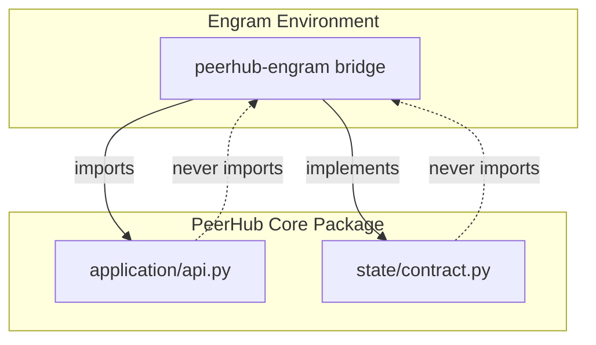

# Phase 1: Engram Bridge Interfaces (v1)

> **Status:** SUPERSEDED BY `PHASE1-ENGRAM-BRIDGE-INTERFACES-V2-2026-08-20.md` (Round 5 Item 4)  
> *Preserved for Round 4 audit history.* See V2 for the complete, production-grade typed contracts, real payloads, and cutover enforcement.

## 1. Document Verification
The citations in cx's round 2 critique have been successfully verified against the source documents:
- **`AUTHORITY-CUTOVER-CONTRACT.md` (Sections 1 & 3)**: Confirmed that during `SHADOW_VALIDATE`, Engram remains the only writer. PeerHub may derive candidates from a read-only snapshot, but must not mutate state. The cut-over contract explicitly requires exactly one live writer at any instant and prohibits "last writer wins" reconciliation.
- **`ARCHITECTURE.md` (Section 2.1, Rule 8)**: Confirmed that "peerhub does not install, update, authenticate, or bundle vendor CLIs (this boundary is permanent)". Vendor installation is strictly outside the engine, verifying the retraction of `HostProvisioningPort`.

## 2. Interface Specifications

All interfaces below represent boundaries where the Engram bridge adapts legacy data into PeerHub's core Engine. 

### 2.1 LegacyStateShadowAdapter
Replaces the `LegacyStateReader` to prevent live read-throughs that violate the single-writer cut-over contract. It functions purely as a versioned, snapshot-based import/shadow adapter.

```python
from dataclasses import dataclass
from typing import Protocol, Mapping

@dataclass(frozen=True)
class LegacyStateSnapshot:
    workspace_identity: str
    schema_version: str
    source_digests: Mapping[str, str]  # SHA-256 hashes of declared files
    cursor: str                        # Monotonic epoch or logical timestamp
    import_digest: str                 # Idempotent candidate PeerHub import digest

class LegacyStateShadowAdapter(Protocol):
    def capture_snapshot(self) -> LegacyStateSnapshot:
        """
        Captures a read-only, frozen snapshot of legacy state.
        Never mutates PeerHub operational state, legacy state, or provider data.
        """
        ...
```

### 2.2 HostCapabilityInventory
Replaces `HostProvisioningPort`. Enforces the permanent boundary that PeerHub does not provision vendor CLIs. Engram provisions independently and submits read-only binding evidence.

```python
from dataclasses import dataclass
from typing import Protocol

@dataclass(frozen=True)
class ExecutableBinding:
    absolute_path: str
    identity_hash: str      # SHA-256 of the executable
    observed_version: str

@dataclass(frozen=True)
class ProvisioningEvidenceReceipt:
    receipt_id: str
    binding: ExecutableBinding
    timestamp: str

class HostCapabilityInventory(Protocol):
    def report_executable_binding(self, capability_name: str) -> ProvisioningEvidenceReceipt:
        """
        Returns a read-only executable binding and an immutable evidence receipt.
        Does not install, update, or control provisioning.
        """
        ...
```

### 2.3 DirectiveAdmissionPort
Replaces `DirectiveSource` to prevent core from reading changing host files mid-request.

```python
from dataclasses import dataclass
from typing import Protocol

@dataclass(frozen=True)
class DirectiveSnapshot:
    scope: str
    source: str
    revision: str
    digest: str
    precedence: int
    effective_time: str
    size_limit_bytes: int
    redaction_policy: str
    provenance: str

class DirectiveAdmissionPort(Protocol):
    def capture_directives(self) -> DirectiveSnapshot:
        """
        Supplies a frozen snapshot at the application or admission boundary.
        """
        ...
```

## 3. Dependency Direction

The dependency direction between the bridge and core is strictly **one-directional**.

**Rule**: The `peerhub-engram` bridge package depends on stable `peerhub` application and import contracts. PeerHub core (`peerhub`) MUST NEVER import or locate `peerhub-engram` itself.



## 4. Standalone PeerHub Support

A PeerHub installation without the Engram bridge remains a fully supported, first-class configuration. This is guaranteed because PeerHub core is decoupled from Engram's implementation via abstract declarative contracts (`LegacyStateShadowAdapter`, `HostCapabilityInventory`, `DirectiveAdmissionPort`).

When deployed as a standalone package, PeerHub operates natively against its own SQLite transactional store (`peerhub.persistence.sqlite`). Host bindings and directives are supplied by a native host layer (e.g., standard CLI configuration) rather than the Engram bridge. Because PeerHub core never imports `peerhub-engram`, the absence of the bridge package has no impact on PeerHub's native routing, adapter dispatch, or session lifecycle.
