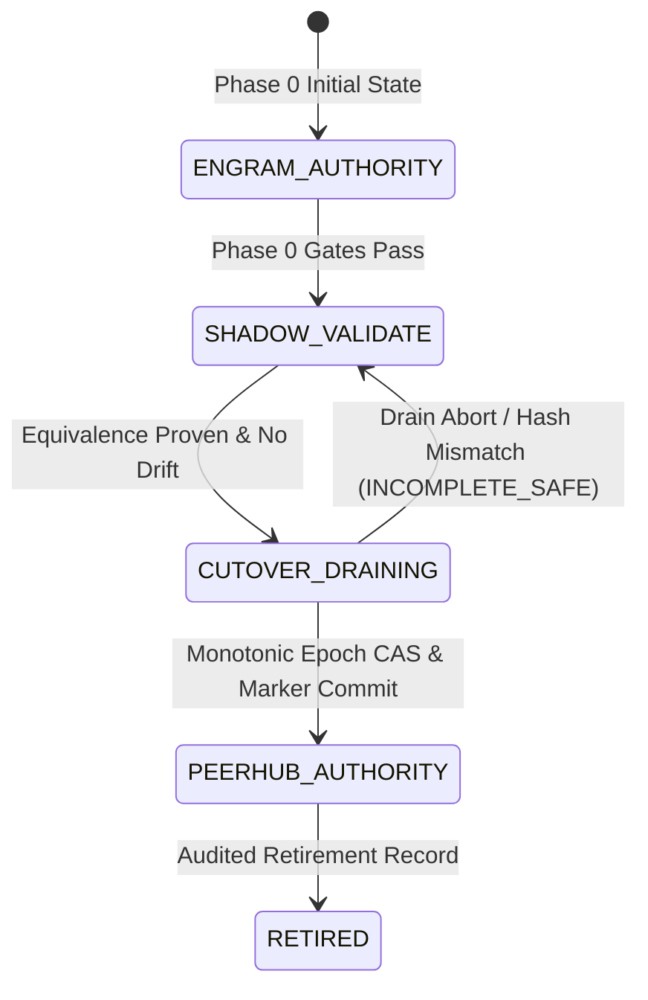
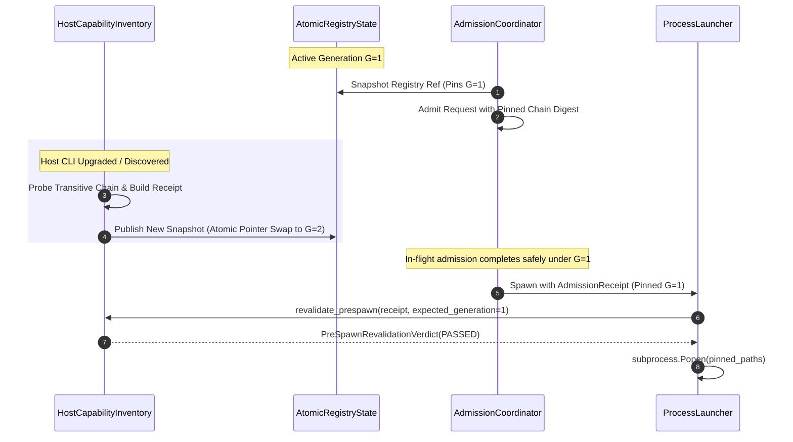
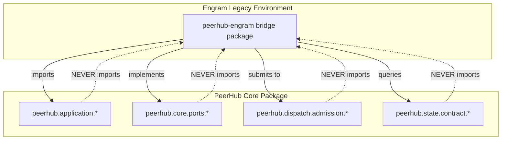

# Phase 1: Engram Bridge Interfaces (v2)

> **Status:** APPROVED DESIGN & TYPED CONTRACT (Round 5 Punch-List Item 4)  
> **Date:** 2026-08-20  
> **Supersedes:** `PHASE1-ENGRAM-BRIDGE-INTERFACES-V1-2026-08-20.md`  
> **Scope:** Grounded, fully typed specifications for `peerhub-engram` bridge interfaces. Replaces metadata shells with real frozen payloads modeled on live legacy files (`.ai/state.json`, `.ai/leases.json`, `_sys/ai/user-directives.md`, `_sys/ai/runtime-directives.jsonl`), concrete state translation and shadow comparison methods, mechanical single-writer cutover-mode enforcement via typed tokens and CAS expected-epoch checks, and atomic transitive capability inventory binding aligned with `PHASE1-ADMISSION-RECEIPTS-REAL-2026-08-20.md`.

---

## 1. Document Control & Evolution Rationale (V1 $\to$ V2)

In Round 4 (`PHASE1-CX-COUNTERCRITIQUE-ROUND4-2026-08-20.md`, Section 4), cx demonstrated that while V1 correctly fixed the dependency direction (pointing `peerhub-engram` toward `peerhub` contracts), the interfaces remained **nonfunctional metadata shells**:
1. `LegacyStateSnapshot` contained only metadata digests without a frozen payload, snapshot reference, subsystem component list, or methods to translate, import, or compare that payload.
2. `DirectiveSnapshot` contained only metadata (scope, digest, precedence) without directive content, preventing `DirectiveAdmissionPort` from supplying usable rules to the dispatch boundary.
3. `HostCapabilityInventory` returned a thin single-executable receipt disconnected from manifest admission, transitive executable chains, pre-spawn revalidation, and atomic inventory revisions.
4. The single-writer rule from `AUTHORITY-CUTOVER-CONTRACT.md` was merely asserted in prose, lacking mechanical enforcement (cutover-mode tokens, expected-epoch checks, admission guards).

This V2 document preserves the V1 debate history while delivering **production-grade, fully typed interfaces** grounded directly in:
- `AUTHORITY-CUTOVER-CONTRACT.md` (Sections 1, 3, 4, and 5)
- Empirical data shapes from live legacy files (`.ai/state.json`, `.ai/leases.json`, `.ai/mailbox.json`, `_sys/ai/user-directives.md`, `_sys/ai/runtime-directives.jsonl`)
- Real-world transitive admission receipts (`PHASE1-ADMISSION-RECEIPTS-REAL-2026-08-20.md`)

---

## 2. Authority Cutover & Mechanical Single-Writer Enforcement

### 2.1. Authority Phase State Machine

Per `AUTHORITY-CUTOVER-CONTRACT.md` Section 1, exactly one live write authority exists at any instant:



| Phase | Authoritative Writer | Permitted PeerHub Operation | Token Type Granted |
|---|---|---|---|
| `ENGRAM_AUTHORITY` | Engram legacy files | Read-only inventory and characterization | `ReadOnlyShadowToken` |
| `SHADOW_VALIDATE` | Engram legacy files | Read / translate / compare only; **zero state mutation** | `ReadOnlyShadowToken` |
| `CUTOVER_DRAINING` | Engram until marker CAS | Admission closed; bounded 120s drain and hash check | `DrainingFenceToken` |
| `PEERHUB_AUTHORITY` | PeerHub SQLite WAL | Sole operational writer; legacy files are read-only | `AuthoritativeWriteToken` |
| `RETIRED` | PeerHub SQLite WAL | Sole writer; legacy compatibility paths disabled | `AuthoritativeWriteToken` |

---

### 2.2. Typed Cutover Tokens & Mechanical Guards

To ensure the single-writer rule is **mechanically enforced by the type system and runtime contracts** rather than developer memory:

```python
from __future__ import annotations
from dataclasses import dataclass
from enum import Enum
from typing import Final, Literal

class AuthorityPhase(str, Enum):
    ENGRAM_AUTHORITY = "ENGRAM_AUTHORITY"
    SHADOW_VALIDATE = "SHADOW_VALIDATE"
    CUTOVER_DRAINING = "CUTOVER_DRAINING"
    PEERHUB_AUTHORITY = "PEERHUB_AUTHORITY"
    RETIRED = "RETIRED"

class CutoverModeViolationError(RuntimeError):
    """Raised when a write operation is attempted under a read-only or invalid authority phase."""
    pass

class CutoverEpochContendedError(RuntimeError):
    """Raised when an expected authority epoch fails CAS verification."""
    pass

@dataclass(frozen=True, slots=True)
class ReadOnlyShadowToken:
    """Token granted exclusively during ENGRAM_AUTHORITY and SHADOW_VALIDATE phases.
    
    Permits snapshot capture, translation, and shadow comparison.
    Does NOT satisfy signatures requiring AuthoritativeWriteToken.
    """
    phase: Literal[AuthorityPhase.ENGRAM_AUTHORITY, AuthorityPhase.SHADOW_VALIDATE]
    observed_epoch: int
    workspace_home_id: str
    declared_write_scope_digests: dict[str, str]

@dataclass(frozen=True, slots=True)
class DrainingFenceToken:
    """Token granted exclusively during CUTOVER_DRAINING.
    
    Permits drain observation, exclusive handle custody validation, and pre-commit rehash.
    """
    phase: Literal[AuthorityPhase.CUTOVER_DRAINING]
    admission_epoch: int
    drain_started_at_utc: str
    exclusive_handles_held: tuple[str, ...]
    admission_file_hashes: dict[str, str]

@dataclass(frozen=True, slots=True)
class AuthoritativeWriteToken:
    """Token required for ALL state-mutating operations.
    
    Granted ONLY when PEERHUB_AUTHORITY has committed its marker transaction.
    """
    phase: Literal[AuthorityPhase.PEERHUB_AUTHORITY, AuthorityPhase.RETIRED]
    authority_epoch: int
    fencing_token: int
    workspace_home_id: str
    database_file_id: str
    marker_commit_watermark: int
```

---

## 3. Real Legacy State Subsystems & Payload Models

### 3.1. Legacy Component Identification

The legacy Engram state spans five distinct subsystem components:

```python
class LegacyComponent(str, Enum):
    COORDINATION_STATE = "COORDINATION_STATE"  # .ai/state.json (room, members, active coordinator, leader)
    MUTATION_LEASES = "MUTATION_LEASES"        # .ai/leases.json (active/closed ask leases, PIDs, expiry)
    MAILBOX = "MAILBOX"                        # .ai/mailbox.json (inter-peer messages, threads, unread counts)
    TASK_REGISTRY = "TASK_REGISTRY"            # .ai/task_registry.json & backlog.json (task lifecycle, failovers)
    CANARY_BUDGET = "CANARY_BUDGET"            # .ai/canary_budget.json & canary_cache.json (model probe budgets)
```

---

### 3.2. Concrete Typed Legacy Payload Models

These models reflect the **exact data shapes** discovered in live `.ai/state.json`, `.ai/leases.json`, and `.ai/mailbox.json`:

```python
from typing import Mapping, Sequence

@dataclass(frozen=True, slots=True)
class CoordinationStatePayload:
    """Exact model of .ai/state.json."""
    room_id: str | None
    members: dict[str, str]
    mission: str | None
    blocked: str | None
    phase: str | None
    active_coordinator: str | None
    human_interface_peer: str | None
    role_assignments: dict[str, str]
    updated_at: str | None

@dataclass(frozen=True, slots=True)
class LegacyLeaseRecord:
    """Exact model of individual lease entries in .ai/leases.json."""
    ask_id: str
    peer_id: str
    pid: int
    room_id: str
    started_at: str
    expires_at: str
    heartbeat_at: str | None
    status: str  # "active", "closed", "timeout", "expired"
    ask_query_file: str | None

@dataclass(frozen=True, slots=True)
class MutationLeasesPayload:
    """Exact model of .ai/leases.json."""
    leases: dict[str, LegacyLeaseRecord]  # lease_key (peer or ask UUID) -> LeaseRecord

@dataclass(frozen=True, slots=True)
class LegacyMailboxMessage:
    """Exact model of message objects in .ai/mailbox.json."""
    id: int
    uuid: str
    thread_id: str
    type: str  # "MSG", "BROADCAST", "ACK"
    sender: str
    recipient: str
    cc: tuple[str, ...]
    content: str
    status: str  # "unread", "read", "archived"
    timestamp: str
    ref: str | None
    priority: str  # "INFO", "WARN", "URGENT"

@dataclass(frozen=True, slots=True)
class MailboxPayload:
    """Exact model of .ai/mailbox.json."""
    messages: tuple[LegacyMailboxMessage, ...]
    unread_count: int

@dataclass(frozen=True, slots=True)
class LegacyTaskRecord:
    task_id: str
    title: str
    status: str
    assigned_peer: str | None
    created_at: str
    updated_at: str
    checkpoint_ref: str | None

@dataclass(frozen=True, slots=True)
class TaskRegistryPayload:
    """Exact model of .ai/task_registry.json & backlog.json."""
    tasks: dict[str, LegacyTaskRecord]

@dataclass(frozen=True, slots=True)
class CanaryBudgetPayload:
    """Exact model of .ai/canary_budget.json."""
    budget_period_start: str
    consumed_tokens: dict[str, int]
    max_tokens_per_peer: dict[str, int]

@dataclass(frozen=True, slots=True)
class FrozenLegacyPayload:
    """Aggregated container holding typed legacy subsystem payloads."""
    coordination: CoordinationStatePayload | None = None
    leases: MutationLeasesPayload | None = None
    mailbox: MailboxPayload | None = None
    tasks: TaskRegistryPayload | None = None
    canary_budget: CanaryBudgetPayload | None = None
```

---

### 3.3. LegacyStateSnapshot Specification

```python
@dataclass(frozen=True, slots=True)
class LegacyStateSnapshot:
    """Frozen, cryptographically verifiable snapshot of legacy Engram state."""
    snapshot_id: str
    workspace_identity: str
    schema_version: str
    cursor: str                                  # Monotonic logical epoch or high-res timestamp
    source_digests: dict[str, str]               # Declared relative path -> SHA-256
    components: tuple[LegacyComponent, ...]      # Subsystems covered by this snapshot
    payload: FrozenLegacyPayload                 # Concrete parsed typed payload
    raw_file_blobs: dict[str, str]               # Raw exact file contents for byte-level rehash
    import_digest: str                           # Deterministic SHA-256 of candidate normalized translation
    captured_at_utc: str
    storage_uri: str | None = None               # Optional external staging path for large dumps
```

---

## 4. State Translation, Idempotent Import & Shadow Comparison

### 4.1. PeerHub Domain Translation Targets

```python
@dataclass(frozen=True, slots=True)
class PeerHubSessionState:
    session_id: str
    room_id: str
    active_peer_kind: str
    assigned_instance_id: str
    opened_at_epoch_ms: int
    expires_at_epoch_ms: int
    is_closed: bool

@dataclass(frozen=True, slots=True)
class PeerHubLeaseState:
    lease_id: str
    session_id: str
    owner_peer_id: str
    owner_pid: int
    fencing_token: int
    authority_epoch: int
    status: str
    expires_at_epoch_ms: int

@dataclass(frozen=True, slots=True)
class PeerHubMessageRecord:
    message_id: str
    thread_id: str
    sender_principal: str
    recipient_principal: str
    body_text: str
    is_delivered: bool
    created_at_epoch_ms: int

@dataclass(frozen=True, slots=True)
class PeerHubTranslatedState:
    """Target typed representation in PeerHub domain models."""
    source_snapshot_id: str
    import_digest: str
    sessions: tuple[PeerHubSessionState, ...]
    leases: tuple[PeerHubLeaseState, ...]
    messages: tuple[PeerHubMessageRecord, ...]
    coordinator_peer: str
    leader_peer: str
    authority_epoch: int
```

---

### 4.2. Translation & Comparison Data Types

```python
class DiffSeverity(str, Enum):
    EQUIVALENT = "EQUIVALENT"
    BENIGN_EXPIRATION = "BENIGN_EXPIRATION"
    RECOVERABLE_DRIFT = "RECOVERABLE_DRIFT"
    CRITICAL_DRIFT = "CRITICAL_DRIFT"

@dataclass(frozen=True, slots=True)
class StateFieldDiff:
    component: LegacyComponent
    entity_key: str
    field_name: str
    legacy_value: str
    peerhub_value: str
    severity: DiffSeverity
    explanation: str

@dataclass(frozen=True, slots=True)
class ShadowComparisonReport:
    comparison_id: str
    evaluated_at_utc: str
    evaluated_epoch: int
    is_equivalent: bool
    consecutive_streak_count: int
    streak_reset_occurred: bool
    matched_components: tuple[LegacyComponent, ...]
    diffs: tuple[StateFieldDiff, ...]
    verdict: Literal["SHADOW_PASS", "SHADOW_DRIFT_DETECTED", "SHADOW_STREAK_RESET"]

@dataclass(frozen=True, slots=True)
class ImportExecutionReceipt:
    receipt_id: str
    source_snapshot_id: str
    target_epoch: int
    committed_watermark: int
    sessions_imported: int
    leases_imported: int
    messages_imported: int
    committed_at_utc: str
```

---

### 4.3. LegacyStateShadowAdapter & Translation Protocols

```python
from typing import Protocol

class LegacyStateTranslationService(Protocol):
    def translate_snapshot(
        self, 
        snapshot: LegacyStateSnapshot
    ) -> PeerHubTranslatedState:
        """Translates raw legacy payloads into PeerHub domain objects deterministically."""
        ...

class LegacyStateShadowAdapter(Protocol):
    """Bridge adapter for shadow verification and cutover state import."""

    def capture_snapshot(
        self, 
        components: tuple[LegacyComponent, ...] | None = None
    ) -> LegacyStateSnapshot:
        """
        Captures a read-only, frozen snapshot of legacy state.
        Guaranteed side-effect free: mutates no PeerHub state, legacy files, or providers.
        """
        ...

    def compare_shadow_state(
        self,
        snapshot: LegacyStateSnapshot,
        token: ReadOnlyShadowToken,
    ) -> ShadowComparisonReport:
        """
        Translates the legacy snapshot and compares it against PeerHub's live StateStore.
        Permitted during SHADOW_VALIDATE phase under ReadOnlyShadowToken.
        """
        ...

    def import_to_peerhub(
        self,
        snapshot: LegacyStateSnapshot,
        token: AuthoritativeWriteToken,
        expected_epoch: int,
    ) -> ImportExecutionReceipt:
        """
        Imports translated legacy state into PeerHub's SQLite transactional store.
        
        MECHANICAL GUARDS:
        1. Requires AuthoritativeWriteToken; calling with ReadOnlyShadowToken fails at type-check and runtime.
        2. Verifies token.authority_epoch == expected_epoch; raises CutoverEpochContendedError on mismatch.
        3. Executes in a single ACID transaction with busy timeout.
        """
        ...
```

---

## 5. Directive Snapshot & Admission Port

### 5.1. Concrete Directive Payload Models

Modeled directly on `_sys/ai/user-directives.md` (standing rules `DIR-001` through `DIR-006`) and `_sys/ai/runtime-directives.jsonl`:

```python
class DirectiveStatus(str, Enum):
    ACTIVE = "ACTIVE"
    SUSPENDED = "SUSPENDED"
    RESOLVED = "RESOLVED"
    EXPIRED = "EXPIRED"
    REVOKED = "REVOKED"

@dataclass(frozen=True, slots=True)
class UserDirectiveRecord:
    """Exact typed representation of a standing user directive (e.g. DIR-001..DIR-006)."""
    directive_id: str                          # e.g. "DIR-001", "DIR-002"
    title: str                                 # e.g. "Minimum Non-Interactive Permissions for All Peers"
    effective_date: str                        # e.g. "2026-06-13"
    status: DirectiveStatus                    # DirectiveStatus.ACTIVE
    scope_peers: tuple[str, ...]               # e.g. ("cc", "gc", "cx", "ag")
    rule_body: str                             # Full verbatim normative rule text
    enforcement_mechanism: str | None          # e.g. "check_cli_reality.py", "AgyAdapter requires_pty"
    provenance: str                            # e.g. "_sys/ai/user-directives.md#DIR-002"

@dataclass(frozen=True, slots=True)
class RuntimeDirectiveRecord:
    """Exact typed representation of dynamic runtime directives (.jsonl)."""
    id: str                                    # e.g. "RD-20260618-001"
    rule: str                                  # e.g. "CAUTION: gc has repeatedly failed with reason=lease_expired..."
    source_peer: str                           # e.g. "gc"
    trigger_reason: str                        # e.g. "lease_expired", "cli_not_found", "empty_response"
    trigger_detail: str                        # Raw error / log excerpt
    effective: str                             # ISO compact timestamp "20260618T164012"
    expires: str                               # ISO compact timestamp "20260618T224012"
    ttl_hours: int                             # e.g. 6
    trigger_count: int
    clear_condition: str                       # e.g. "first_success"
    status: DirectiveStatus                    # DirectiveStatus.ACTIVE or RESOLVED
    target_peers: tuple[str, ...]              # e.g. ("cc",)
    resolved_at: str | None = None

@dataclass(frozen=True, slots=True)
class EffectiveDirectiveRule:
    """Resolved directive rule ready for application or prompt injection."""
    rule_id: str
    precedence: int                            # 100=UserDirective, 50=RuntimeDirective, 10=Default
    source: str                                # "USER_DIRECTIVE" or "RUNTIME_DIRECTIVE"
    rule_text: str
    target_peer_kind: str
    is_blocking: bool
```

---

### 5.2. DirectiveSnapshot Specification

```python
@dataclass(frozen=True, slots=True)
class DirectiveSnapshot:
    """Frozen snapshot of all active user and runtime directives."""
    snapshot_id: str
    governed_config_revision: str              # Git commit SHA binding the configuration
    content_digest: str                        # SHA-256 digest of canonical concatenated rules
    captured_at_utc: str
    user_directives: tuple[UserDirectiveRecord, ...]
    runtime_directives: tuple[RuntimeDirectiveRecord, ...]
    raw_markdown_injection: str                # Exact rendered [USER DIRECTIVES] block

    def resolve_for_peer(
        self, 
        peer_kind: str, 
        profile_id: str
    ) -> tuple[EffectiveDirectiveRule, ...]:
        """Resolves active, non-expired rules applicable to the given peer and profile in precedence order."""
        rules: list[EffectiveDirectiveRule] = []
        
        # 1. User Directives (Highest Precedence: 100)
        for ud in self.user_directives:
            if ud.status == DirectiveStatus.ACTIVE:
                if "all" in ud.scope_peers or peer_kind in ud.scope_peers:
                    rules.append(EffectiveDirectiveRule(
                        rule_id=ud.directive_id,
                        precedence=100,
                        source="USER_DIRECTIVE",
                        rule_text=ud.rule_body,
                        target_peer_kind=peer_kind,
                        is_blocking=True
                    ))
                    
        # 2. Runtime Directives (Precedence: 50)
        for rd in self.runtime_directives:
            if rd.status == DirectiveStatus.ACTIVE:
                if not rd.target_peers or peer_kind in rd.target_peers:
                    rules.append(EffectiveDirectiveRule(
                        rule_id=rd.id,
                        precedence=50,
                        source="RUNTIME_DIRECTIVE",
                        rule_text=rd.rule,
                        target_peer_kind=peer_kind,
                        is_blocking=False
                    ))
                    
        return tuple(sorted(rules, key=lambda r: r.precedence, reverse=True))
```

---

### 5.3. DirectiveAdmissionPort Protocol

```python
@dataclass(frozen=True, slots=True)
class DirectiveAdmissionVerdict:
    admitted: bool
    snapshot_id: str
    content_digest: str
    active_rules_count: int
    rejection_reason: str | None = None

class DirectiveAdmissionPort(Protocol):
    """Application boundary port supplying immutable directives to dispatch."""

    def capture_directives(
        self, 
        scope: str = "all"
    ) -> DirectiveSnapshot:
        """
        Supplies an atomic, frozen directive snapshot at the admission boundary.
        Guarantees isolation against mid-flight file edits on disk.
        """
        ...

    def validate_directive_admission(
        self,
        snapshot: DirectiveSnapshot,
        expected_config_revision: str | None = None,
    ) -> DirectiveAdmissionVerdict:
        """Validates snapshot integrity, expiry, and config revision alignment."""
        ...
```

---

## 6. Host Capability Inventory & Transitive Admission Binding

### 6.1. Transitive Chain Models & Evidence Alignment

Directly aligned with `PHASE1-ADMISSION-RECEIPTS-REAL-2026-08-20.md`:

```python
class ExecutableRole(str, Enum):
    ENTRYPOINT_WRAPPER = "ENTRYPOINT_WRAPPER"  # .cmd or .bat batch scripts
    INTERPRETER = "INTERPRETER"                # node.exe, python.exe
    SCRIPT = "SCRIPT"                          # codex.js, cli-wrapper.cjs
    NATIVE_BINARY = "NATIVE_BINARY"            # claude.exe, codex.exe, agy.exe
    HELPER_BINARY = "HELPER_BINARY"            # rg.exe, codex-code-mode-host.exe

@dataclass(frozen=True, slots=True)
class TransitiveExecutableNode:
    """Individual node in the transitive execution graph."""
    role: ExecutableRole
    canonical_path: str
    file_size_bytes: int
    sha256: str
    is_reparse_point: bool

@dataclass(frozen=True, slots=True)
class AclEvaluationEvidence:
    """NTFS non-world-writable ACL verification."""
    evaluated_paths: tuple[str, ...]
    volume_type: str                           # Must be "NTFS"
    everyone_writable: bool                    # Must be False
    anonymous_writable: bool                   # Must be False
    authenticated_users_modify_allowed: bool   # Permitted True on local developer workstation
    effective_dacl_summary: str
    verdict: Literal["PASS_SECURE_LOCAL", "FAIL_WORLD_WRITABLE", "FAIL_NON_NTFS"]

@dataclass(frozen=True, slots=True)
class ProvisioningEvidenceReceipt:
    """Complete, immutable evidence receipt emitted by HostCapabilityInventory."""
    receipt_id: str
    schema_version: Literal["2.0.0"]
    adapter_id: str
    peer_kind: str
    inventory_generation: int                  # Monotonic generation counter
    trust_root: dict[str, str]                 # host_machine, user_sid, activation_authority
    observed_vendor: dict[str, str | None]     # observed_cli_version, package_json_version
    acl_evaluation: AclEvaluationEvidence
    transitive_executable_chain: tuple[TransitiveExecutableNode, ...]
    companion_binaries: tuple[TransitiveExecutableNode, ...]
    aggregate_chain_digest: str                # SHA-256 of sorted Role:Path:SHA256
    timestamp_utc: str
```

---

### 6.2. Atomic Inventory Generation & Reader Synchronization

To prevent capability inventory discovery from racing with in-flight admissions:



```python
@dataclass(frozen=True, slots=True)
class PreSpawnRevalidationVerdict:
    passed: bool
    revalidated_generation: int
    failed_check: str | None
    mismatched_paths: tuple[str, ...]

class HostCapabilityInventory(Protocol):
    """Bridge interface reporting empirical host capabilities without performing provisioning."""

    def get_current_generation(self) -> int:
        """Returns the current monotonic registry generation integer."""
        ...

    def report_capability_evidence(
        self, 
        capability_name: str,
        expected_generation: int | None = None
    ) -> ProvisioningEvidenceReceipt:
        """
        Inspects the host, resolves the full transitive executable chain, verifies NTFS ACLs,
        computes the aggregate chain digest, and returns an immutable ProvisioningEvidenceReceipt.
        """
        ...

    def revalidate_prespawn(
        self,
        receipt: ProvisioningEvidenceReceipt,
        pinned_generation: int,
    ) -> PreSpawnRevalidationVerdict:
        """
        Executes immediate pre-spawn revalidation:
        1. Verifies generation == pinned_generation (or verified forward-compatible).
        2. Re-stats and re-hashes every file in transitive_executable_chain.
        3. Verifies no reparse points exist in the resolved paths.
        4. Re-computes aggregate_chain_digest and compares against receipt.
        """
        ...
```

---

## 7. Concrete Connection to Manifest Admission Flow

The bridge interfaces connect into `peerhub.dispatch.admission.AdmissionCoordinator` through a deterministic 4-stage pipeline:

```
[HostCapabilityInventory]
         │ (emits ProvisioningEvidenceReceipt)
         ▼
[Manifest Admission Gate] ──► Validates Manifest Canonical AST + Engine Hash + Transitive Chain
         │
         ▼
[AdmissionCoordinator] ──► Mints AdmissionReceipt (Pins Aggregate Chain Digest + Generation G)
         │
         ▼
[Pre-Spawn Revalidation] ──► HostCapabilityInventory.revalidate_prespawn() ──► Safe subprocess.Popen
```

1. **Discovery & Verification**: `HostCapabilityInventory` queries host executables and produces a `ProvisioningEvidenceReceipt` with the full transitive chain (`claude.cmd` $\to$ `claude.exe`, `codex.cmd` $\to$ `node.exe` $\to$ `codex.js` $\to$ `codex.exe`).
2. **Admission Pinning**: `AdmissionCoordinator.admit_request()` records the `aggregate_chain_digest`, manifest SHA-256, and `registry_generation` in the durable `AdmissionReceipt`.
3. **Execution Guard**: Prior to executing the subprocess, `revalidate_prespawn()` re-verifies every hash in the chain through retained file handles. Any on-disk modification aborts execution before process creation.

---

## 8. Dependency Direction & Standalone PeerHub Guarantee



### Standalone Guarantee
In a standalone PeerHub deployment without `peerhub-engram`:
1. Core runs natively against its own SQLite transactional store (`peerhub.persistence.sqlite`).
2. Host capabilities are registered via native declarative manifests (`manifests/*.json`).
3. Directives are loaded via native CLI config or application context.
4. Because PeerHub core has **zero imports of `peerhub-engram`**, the absence of the bridge package has zero runtime impact.

---

## 9. Verification & Punch-List Closure Matrix

| Punch-List Item 4 Requirement | Implementation in V2 | Verification / Contract Reference |
|---|---|---|
| **Real Frozen Legacy Payload** | `LegacyStateSnapshot` carries `FrozenLegacyPayload` (`CoordinationStatePayload`, `MutationLeasesPayload`, `MailboxPayload`, `TaskRegistryPayload`, `raw_file_blobs`). | Section 3.2, 3.3 |
| **Component Identification** | `LegacyComponent` enum explicitly enumerates `COORDINATION_STATE`, `MUTATION_LEASES`, `MAILBOX`, `TASK_REGISTRY`, `CANARY_BUDGET`. | Section 3.1 |
| **Translation, Import, Compare APIs** | Concrete methods `translate_snapshot()`, `compare_shadow_state()`, and `import_to_peerhub()` with typed diffs and receipts. | Section 4.2, 4.3 |
| **Real Directive Payload** | `DirectiveSnapshot` carries parsed `UserDirectiveRecord` (`DIR-001`..`DIR-006`), `RuntimeDirectiveRecord` (`RD-...`), and resolution methods. | Section 5.1, 5.2 |
| **Transitive Host Capability Inventory** | `HostCapabilityInventory` reports full `TransitiveExecutableNode` chains, NTFS ACL evidence, and `aggregate_chain_digest`. | Section 6.1, 6.2 |
| **Atomic Inventory Revision** | Monotonic `inventory_generation` tracking with RCU atomic swap and pre-spawn revalidation. | Section 6.2 |
| **Mechanical Cutover Enforcement** | `ReadOnlyShadowToken`, `DrainingFenceToken`, and `AuthoritativeWriteToken` typed tokens reject writes during `SHADOW_VALIDATE`. | Section 2.2, 4.3 |
